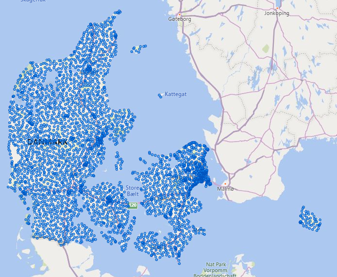
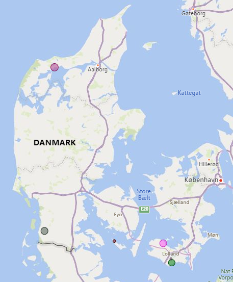

# Business-Intelligence

Group Name : Ill Introduction 
Group Members : Lovro Bilješković, Mikkel Lindstrøm Hansen, Pravien Thaveenrasingam

# Assingment - 4

## Requirements:
- Make sure you have Power BI installed.
- Download the assignment-4.pbit which is a template for the power bi (client itself is too big) open up the Power BI file in your Power BI.
- Then take the csv file from assignment 2/3 with geocodes in them and add that as a data source for the data.
- The assignment itself is runned throug azure with a DB but only one IP is allowed.

## Assignments: 

## 7:

Map of denmark with all the geocodes placed.

### 8 : 

One dot for each zip code with the dot size representing the average price for that zip.

A more detailed look into Copenhagen to see the dot size is actually different.

## 9(freestyle):
Only these few places where a house has been sold for less than 5000 kroner pr square meter. (dot in hillerød and copenhagen is on the map by default so not anything showing in these locations)
