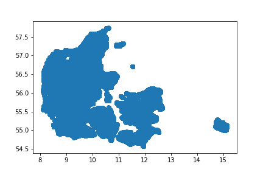
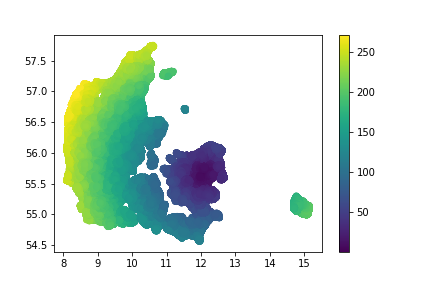

# Business-Intelligence

Group Name : Ill Introduction<br/>
Group Members : Lovro Bilješković, Mikkel Lindstrøm Hansen, Pravien Thaveenrasingam

# Assignment - 2

## Read the entire dataset of Danish housing sales data, from Boliga, into a Pandas DataFrame. Use the read_csv function from the pandas module.

Here is the function which generates the dataframe.

```python
def create_data_frame():
    li = []
    for filename in os.listdir('./boliga_stats'):
        #filename = os.path.join(os.getcwd(),filename)
        df = pd.read_csv(os.path.join('./boliga_stats',filename), index_col=None, header=0)
        li.append(df)

    return pd.concat(li, axis=0, ignore_index=True)
```

## Geocode the the entire dataset of Danish housing sales data. Add two new columns to the DataFrame, one for latitude (lat) and one for longitude (lon) coordinates per address

```python
df['long'],df['lat'] = zip(*df.apply(lambda row : get_geo_code(row['address'],row['zip_code_num'],data), axis=1))
# removing values where the lattitude and longitude is None.
df = df.dropna()
df.to_csv('./house_sale_data_with_geocodes.csv', index=False,encoding='utf-8')
```

## Convert all sales dates in the dataset into proper datetime objects

```python
df['sell_date'] = pd.to_datetime(df['sell_date'],format='%d-%m-%Y')
```

## Compute the average price per square meter for the years 1992 and 2016 respectively for the city centers of Copenhagen (zip code 1050-1049), Odense (zip code 5000), Aarhus (zip code 8000), and Aalborg (zip code 9000). Create two new DataFrames, one for the year 1992 and one for the year 2016, which contain the respective zip codes and the average price per square meter corresponding to the aforementioned cities. Let the DataFrames be sorted by ascending prices.

```python
list_1992 = []
list_2016 = []
for mask,zip_code,year in masks:
    avg_sqr_price = calulate_avg_year(df,mask,year,zip_code)
    if year == '1992':
        list_1992.append((zip_code,avg_sqr_price))
    else:
        list_2016.append((zip_code,avg_sqr_price))

df_2016 = pd.DataFrame(list_2016,columns=['zipcode', 'avg_sqr_m_price'])
df_1992 = pd.DataFrame(list_1992,columns=['zipcode', 'avg_sqr_m_price'])
```


## Create, with the help of the pandas module, four new CSV files containing the sales data for the year 1992 for the city centers of Copenhagen (zip code 1050-1049), Odense (zip code 5000), Aarhus (zip code 8000), and Aalborg (zip code 9000).

``` python
def create_city_csv(dataframe, year):
    cities = {
              'Odense': '5000',
              'København': '1050',
              'Aarhus': '8000',
              'Aalborg': '9000'}
    folder_path = join(os.getcwd(),year)          
    if not os.path.exists(folder_path):
        os.mkdir(folder_path)
        
    for city in cities:
        mask = ((dataframe['zip_code_num'] == cities[city]) & (df['sell_date'].dt.year == int(year)))
        dataf = dataframe[mask]
        dataf.to_csv('./' + year + '/' + city + ".csv", index=False,encoding='utf-8')

create_city_csv(df, '1992')
```

## Create a 2-dimensional scatter plot, which contains a dot for each location in the dataset of Danish housing sales data. Plot the longitude values on the x- axis and plot the latitude values on the y-axis.


## Create another scatter plot as in the task above, but use the computed distances as color values
